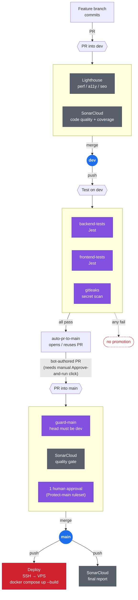

<!-- doctype markdown -->
<title>CI/CD Pipeline</title>

# CI/CD Pipeline

Two long-lived branches — `dev` (pre-prod) and `main` (prod) — connected by an automated promotion path. Everything below reflects what's actually configured in `.github/workflows/`, not an aspirational version.

## Legend

| Color | Meaning |
|---|---|
| 🔵 Blue | A branch (`dev` / `main`) |
| 🟣 Purple | **Gate** — must pass or the merge is blocked / promotion doesn't happen |
| ⚪ Grey | **Advisory** — runs and reports, doesn't block anything |
| 🔴 Red | Deployment |

## Known quirk: the bot-approval click

`auto-pr-to-main` opens the `dev → main` PR using `GITHUB_TOKEN`, so it's authored by `github-actions[bot]`. Any `pull_request`-triggered workflow scoped to `main` (`guard-main`, `SonarCloud`'s `main` leg) requires a manual "Approve and run" click on that specific PR every time — GitHub's workflow-approval gate treats bot-authored PRs the same as a first-time external contributor. This is why `SonarCloud` and `Lighthouse` review PRs into **`dev`** instead (human-authored, no click needed) rather than `main`.

## What's not shown

- `test-on-dev.yml` and `guard-main.yml` are separate workflow files; the diagram groups their jobs by the branch event that triggers them, not by file.
- Swagger/OpenAPI docs (`/api-docs`) and the `.gitleaks.toml` allowlist exist in the repo but aren't pipeline steps — they don't run on push/PR.
- Deferred, not built: Playwright e2e, PostHog / Prometheus+Grafana observability.
